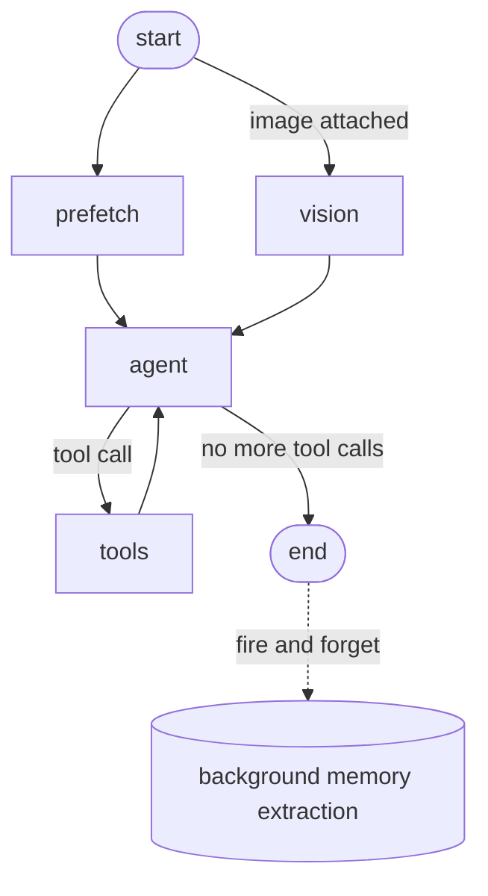
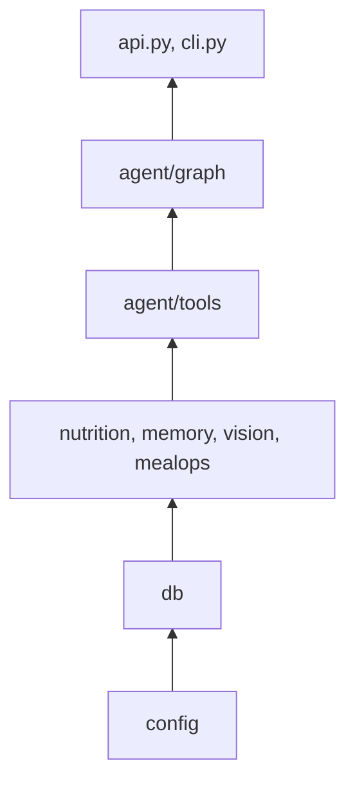
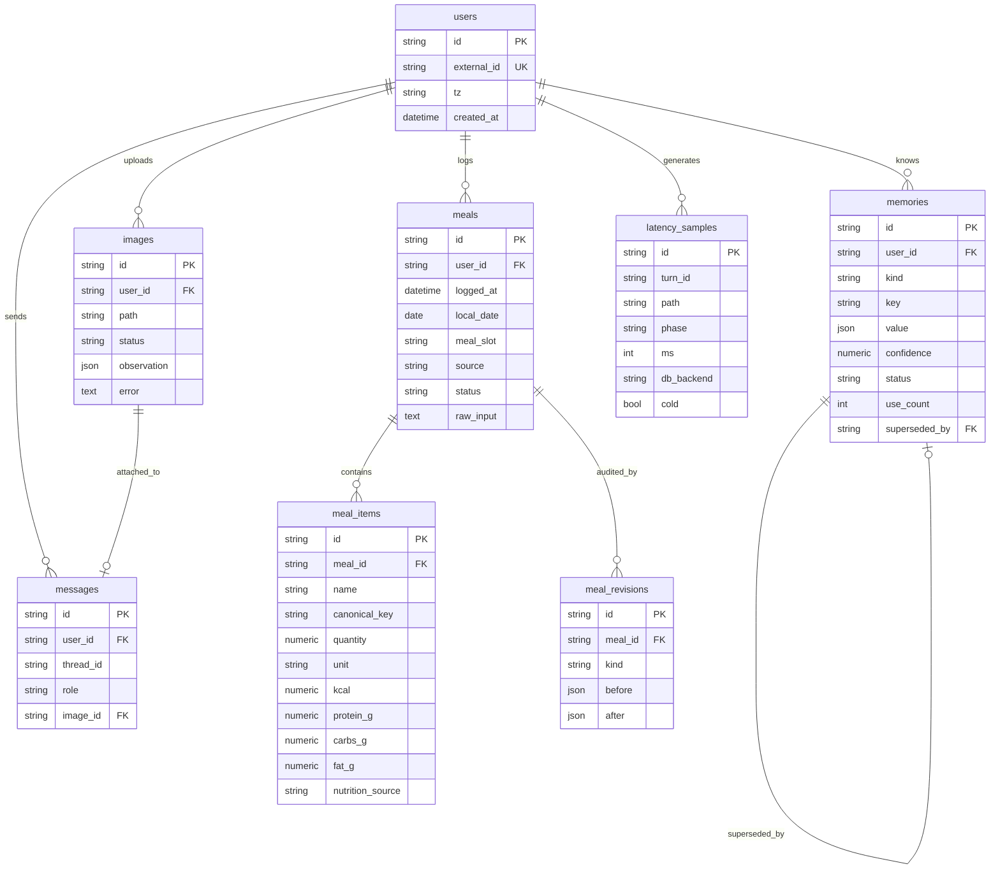

[](README.md)

# System Design

This documents the actual system as built: the request flow, the module boundaries, and
the database schema. It matches the codebase directly; nothing here is aspirational.

## Contents

- [Request flow](#request-flow)
- [Module layout](#module-layout)
- [Data model](#data-model)
- [Model roles](#model-roles)
- [Key invariants](#key-invariants)

---

## Request flow

Every inbound message, text or image, goes through the same LangGraph state machine.
`start` fans out into `prefetch` (always) and `vision` (only if an image is attached),
which run concurrently. Both feed into `agent`, which loops with `tools` until it has
nothing left to call, then ends.



**`prefetch`** (`app/agent/prefetch.py`): one `asyncio.gather` over today's totals,
a recent-meals digest, and ranked memory facts. Rendered into a single block appended
to the system prompt, so the agent answers most read-only questions with zero tool
calls.

**`vision`** (`app/vision/process.py`): resolves the attached image to a structured
`VisionObservation`, either from cache (`Image.status='ready'`) or a live call to
`app/vision/extract.py`. Injected into the same agent turn as the caption text, so a
photo with a caption produces exactly one `log_meal` call, not two.

**`agent`** (`app/agent/graph.py::agent_node`): builds the system prompt (static
persona and policy, then the prefetch block, then any vision observation), trims
history to `HISTORY_TURNS`, and calls the LLM with all 6 tools bound.

**`tools`** (`langgraph.prebuilt.ToolNode`): executes whichever tool the model called
and returns the result as a `ToolMessage`, looping back into `agent`.

**Background memory extraction**: after the graph returns, `app/memory/extractor.py`
runs as a detached `asyncio.create_task` on its own DB session. It can never add
latency to the reply and a failure there can never break the turn.

### HTTP surface

`app/api.py` is a thin transport layer over the same graph; it holds no business logic.

| Route | Method | Does |
|---|---|---|
| `/` | GET | Serves the static chat UI |
| `/upload` | POST | Downscales an image, stores it, kicks off vision extraction in the background (prewarm) |
| `/chat` | POST | Runs the graph, streams the reply over SSE, emits a `meal_logged` event the instant a meal is logged |
| `/totals` | GET | Today's (or a given day's) derived totals |
| `/meals` | GET | Recent meals for a user |

`app/cli.py` is the same graph driven from a terminal loop instead of HTTP.

---

## Module layout

```
app/
├── config.py         Typed settings. The only file where a model ID, base URL,
│                      or DB URL may appear. Owns the API key pool.
├── telemetry.py       Phase timers, fire-and-forget writes to latency_samples.
├── api.py             FastAPI: SSE /chat, /upload, /totals, /meals.
├── cli.py             Terminal entry point over the same graph.
│
├── db/
│   ├── models.py       The 8 tables (below), SQLAlchemy 2.0 declarative.
│   ├── client.py       Process-lifetime async engine, session factory.
│   └── repo.py         The only module that writes SQL.
│
├── nutrition/
│   ├── table.py         ~60 hardcoded foods, canonical units.
│   ├── normalize.py      Plural/synonym normalization to a canonical key.
│   └── resolve.py        table lookup, then LRU cache, then batched LLM fallback.
│
├── mealops/
│   └── logging_ops.py   log_meal / revise_meal / get_totals: the layer between
│                          the tools and repo.py. Totals are never stored here,
│                          only ever computed fresh from repo.daily_totals.
│
├── memory/
│   ├── store.py          write / rank / budget / retrieve durable facts.
│   └── extractor.py      background structured fact proposal.
│
├── vision/
│   ├── schema.py         VisionObservation / VisionItem (Pydantic).
│   ├── downscale.py      Resize to IMAGE_MAX_EDGE, aspect preserved.
│   ├── extract.py        The vision model call: json_object mode, validate,
│   │                      retry once, then raise (never fabricate).
│   └── process.py        Cache-or-extract by image_id.
│
├── agent/
│   ├── graph.py           StateGraph wiring (see Request flow above).
│   ├── state.py           Typed AgentState.
│   ├── prefetch.py        The parallel prefetch fan-out.
│   ├── prompts.py         Static system prompt + prefetch-block renderer.
│   └── tools/
│       ├── logging.py     log_meal, revise_meal
│       ├── query.py       get_daily_totals, search_meals
│       └── memory.py      remember, recall
│
└── static/index.html   Single-file chat UI, no build step.
```

### Dependency direction

Strictly one-directional. A module may depend on anything above it, never below.



This is why the correctness core (`mealops`, `db/repo.py`) could be built and tested
before the agent existed at all: it has no dependency on LangGraph, or on any LLM
client, and none of the domain services import from `agent/`.

---

## Data model

Eight tables, one SQLite database (`DATABASE_URL`, Postgres-portable but not
independently tested in this build).



| Table | Purpose | Written by |
|---|---|---|
| `users` | Identity + timezone, no auth | first sight of an `X-User-Id` |
| `meals` | One logged eating event | `log_meal` |
| `meal_items` | Foods in a meal, macros already multiplied by quantity | `log_meal`, `revise_meal` |
| `meal_revisions` | Audit trail of every mutation | `revise_meal` |
| `memories` | Durable typed facts about the user | `remember` tool + background extractor |
| `messages` | Conversation transcript | every turn, in the background |
| `images` | Uploaded photos + cached vision result | `/upload`, the vision node |
| `latency_samples` | Per-phase timings for the p50/p95 report | `telemetry.py`, fire-and-forget |

### The one query that decides correctness

```python
async def daily_totals(session, user_id: str, day: date) -> Totals:
    stmt = (
        select(
            func.coalesce(func.sum(MealItem.kcal), 0),
            func.coalesce(func.sum(MealItem.protein_g), 0),
            func.coalesce(func.sum(MealItem.carbs_g), 0),
            func.coalesce(func.sum(MealItem.fat_g), 0),
            func.coalesce(func.sum(MealItem.fiber_g), 0),
        )
        .select_from(MealItem)
        .join(Meal, Meal.id == MealItem.meal_id)
        .where(
            Meal.user_id == user_id,
            Meal.local_date == day,
            Meal.status == "active",
        )
    )
    return Totals(*(await session.execute(stmt)).one())
```

There is no `total_kcal` column anywhere in the schema. Every total shown to the user
is this aggregate, computed fresh, every time. A correction is `repo.replace_meal_items`
on the existing row; it is structurally impossible for it to double-count, because
there is nothing cached to double.

### Indexes

| Index | On | Serves |
|---|---|---|
| `ix_meals_user_date_status` | `meals(user_id, local_date, status)` | the daily-totals query |
| `ix_meals_user_created` | `meals(user_id, created_at)` | `meal_ref="last"` resolution |
| `ix_meal_items_meal` | `meal_items(meal_id)` | loading a meal's items |
| `uq_memories_active` | `memories(user_id, kind, key)` where `status='active'` | supersede, not duplicate, enforced at the DB level |
| `ix_memories_user_status_kind` | `memories(user_id, status, kind)` | retrieval ranking |
| `ix_latency_path_phase` | `latency_samples(path, phase)` | the p50/p95 report |
| `ix_latency_turn` | `latency_samples(turn_id)` | grouping one turn's phases |

---

## Model roles

Three roles, one model in this build (`gemini-3.1-flash-lite`), called through a
round-robin key pool. Full reasoning for this choice is in the README's
[Model choices](README.md#model-choices) section; this is just where each role lives.

| Role | Called from |
|---|---|
| `TEXT_MODEL` | `app/agent/graph.py::build_llm`, via `langchain-google-genai` |
| `VISION_MODEL` | `app/vision/extract.py::extract_vision`, raw `httpx` against the OpenAI-compat endpoint |
| `EXTRACTOR_MODEL` | `app/memory/extractor.py::extract_facts`, raw `httpx` |

`app/config.py::next_api_key` is the single round-robin cycle every call site shares;
adding a key to `LLM_API_KEYS_EXTRA` benefits all three roles at once.

---

## Key invariants

These are enforced structurally, not by convention:

- **No stored running total.** Verified above; nothing in `meal_items` or `meals`
  caches a sum.
- **Vision never enters the text conversation.** It is a graph node with its own
  structured-only prompt, never a tool the text model calls into.
- **Memory is not conversation history.** `memories` (durable facts), `messages`
  (transcript), and the LangGraph checkpointer (ephemeral turn state) are three
  physically separate stores.
- **`repo.py` is the only module that writes SQL.** Every other module, including
  the agent tools, calls into it rather than querying directly.
- **`config.py` is the only file that may contain a model ID, base URL, or DB URL.**
