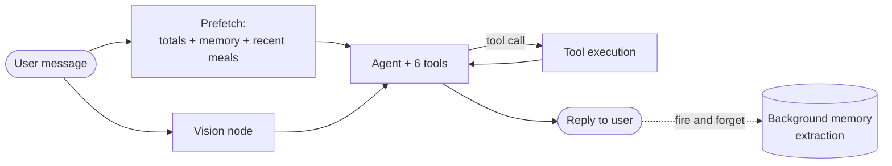

# CalorAI Meal Logger

A conversational agent that logs meals the way people actually text about food:
half-sentences, corrections, photos, "same as yesterday". Built on LangGraph, with a
separate vision model, typed cross-session memory, and derived (never stored) daily
totals so a correction can never double-count.

Built for CalorAI's AI Engineer (Conversational Agents) test task.

📐 **[System design and full data model: ARCHITECTURE.md](ARCHITECTURE.md)**

---

## Overview

CalorAI Logging Agent lets a user log meals by texting or sending a photo, in plain
language, with no forms and no dropdowns. It runs on LangGraph, keeps daily calorie
and macro totals correct through edits and corrections, routes photos to a separate
vision model, and remembers durable facts about the user (diet, goals, routines)
across sessions, retrieving them selectively so the prompt never bloats.

**What it does:**

- Logs a meal from a plain-language message, resolving items against a local
  nutrition table with an LLM fallback for anything unrecognized
- Accepts a photo (with or without a caption) and logs it through a separate vision
  model, never mixing image content into the text conversation
- Corrects an existing meal on request ("actually that was 3 rotis not 2"), always
  as an update to the same row, never a second entry
- Answers "how am I doing today?" at any point with an accurate, freshly-computed
  total, never a cached or stored one
- Remembers durable facts (vegetarian, protein target, "my usual" breakfast) across
  sessions and uses them to inform later replies, without dumping conversation
  history into the prompt
- Decides for itself when to log with a stated assumption versus asking one
  clarifying question, so it feels like texting a friend rather than filling out a
  form

**Tools available to the agent:**

| Tool | Purpose |
|---|---|
| `log_meal` | Creates a new meal |
| `revise_meal` | Edits or deletes an existing meal; the only path for corrections |
| `get_daily_totals` | Reads calorie/macro totals for a given day |
| `search_meals` | Looks up past meals by date, for things like "same as yesterday" |
| `remember` | Writes an explicit durable fact the user stated about themselves |
| `recall` | Looks up a stored fact not already present in the prefetched context |

**Also included (bonus):** a 14-case eval suite over the brief's test conversation
set, multi-user session isolation, SSE streaming with a `meal_logged` event, and
image prewarm caching. Full detail on each of these is in the sections below.

---

## Table of contents

- [Overview](#overview)
- [Setup](#setup)
- [Core features](#core-features)
- [Architecture at a glance](#architecture-at-a-glance)
- [Model choices](#model-choices)
- [How memory works](#how-memory-works)
- [Tool design](#tool-design)
- [Multi-turn ambiguity handling](#multi-turn-ambiguity-handling)
- [Latency](#latency)
- [Assumptions and trade-offs](#assumptions-and-trade-offs)
- [Test conversation set coverage](#test-conversation-set-coverage)
- [Bonus features implemented](#bonus-features-implemented)
- [Time breakdown](#time-breakdown)
- [What I'd fix or build next](#what-id-fix-or-build-next)
- [AI tool usage](#ai-tool-usage)

---

## Setup

Requires Python 3.11+.

```bash
git clone <repo-url>
cd ai-meal-logger

python -m venv .venv
source .venv/bin/activate          # Windows: .venv\Scripts\activate

pip install -r requirements.txt

cp .env.example .env               # then put a real key in LLM_API_KEY
```

`.env.example` ships working defaults for everything except the API key. Default
provider is Gemini's own OpenAI-compatible endpoint (free, no card; get a key at
[aistudio.google.com/apikey](https://aistudio.google.com/apikey)); any other
OpenAI-compatible endpoint works by changing `LLM_BASE_URL` alone. Default database is
a local SQLite file, so there's nothing else to install or provision.

**Optional: a key pool.** `LLM_API_KEYS_EXTRA` accepts additional comma-separated
keys, round-robin-ed with `LLM_API_KEY`. Free-tier Gemini keys carry per-model daily
quotas; a small pool buys real headroom without adding billing. Every key in the pool
is verified independently, not just the primary (see below).

### Verify model access before relying on it

```bash
python scripts/check_models.py
```

Free-tier model IDs get renamed, retired, and rate-limited without notice, and this
script proved its worth twice during the build (see [Model
choices](#model-choices)). It pings every key in the pool against all
three model roles, sending a real test image for the vision check, and exits non-zero
if any key/role combination is unreachable.

### Run it

```bash
python -m app.cli                  # terminal chat, accepts --image PATH
# or
python -m uvicorn app.api:app      # FastAPI + SSE + minimal web chat at :8000
```

### Tests, evals, and the offline verification suite

```bash
pytest                             # 36 tests, fully offline, no API key needed
python evals/run_evals.py          # 14 cases (11 brief messages + 3 graded regressions)
python scripts/verify_db.py        # + 4 more verify_*.py scripts, one per subsystem
python scripts/bench.py            # latency harness, scripted LLM by default
python scripts/bench.py --real     # same harness against the real configured LLM
```

All of the above run with **no API key and no network** except `check_models.py` and
`bench.py --real`, which need a live key on purpose.

---

## Core features

| # | Feature | Where |
|---|---------|-------|
| 1 | Conversational agent, tool calling | `app/agent/graph.py` (LangGraph), `app/agent/tools/` |
| 2 | Persistent database | `app/db/`: SQLAlchemy 2.0 async ORM, SQLite |
| 3 | Running daily totals, correct through edits | `app/db/repo.py::daily_totals`, always a SQL aggregate, never stored |
| 4 | Image on a separate model | `app/vision/`: `gemini-3.1-flash-lite`, routed as a graph node, not a tool |
| 5 | Persistent memory | `app/memory/`: typed facts, ranked + budgeted retrieval |
| 6 | Multi-turn ambiguity handling | `app/agent/prompts.py`: log-with-assumption policy |

---

## Architecture at a glance



Prefetch and vision run in parallel; prefetch alone is what makes query turns
("how am I doing on calories?") and "same as yesterday" cost **zero tool calls**.

---

## Model choices

**Every role, text, vision, background memory extraction, runs on
`gemini-3.1-flash-lite`, called through a round-robin pool of API keys.** This
wasn't the original plan; two real problems forced the pivot.

**The issues.** The build started with three distinct models, the standard shape
for this task. That broke for two reasons: (1) a confirmed, open upstream bug,
Gemini 3.x requires a `thought_signature` echoed back on every tool-calling turn,
and `langchain-openai` silently drops that field, so the graded correction case
failed on turn two (`langchain-ai/langchain#34056`); fixed by switching to
`langchain-google-genai`. (2) An explicit cost constraint, combined with
`gemini-2.5-flash` and `gemini-2.5-flash-lite` both being listed in the API's
model catalog but 404ing on every real call for this project, wasted a first
round of picks. `gemini-3.1-flash-lite` is the model that came back confirmed
live (auth, tool calling, image input) across every key, so all three roles
run on it.

**Where each model role is used, and the best-fit choice per role:**

| Role | Used for | Called from | Current model | Best-fit model |
|---|---|---|---|---|
| `TEXT_MODEL` | Conversational agent; the only role doing tool calling | `app/agent/graph.py::build_llm` | `gemini-3.1-flash-lite` | `gemini-3.6-flash` ($0.75 / $3.75 per 1M): stronger instruction-following, and this is the one role where tool-calling reliability actually matters |
| `VISION_MODEL` | Image → structured food observation, never conversational | `app/vision/extract.py::extract_vision` | `gemini-3.1-flash-lite` | `gemini-3.1-flash-lite` stays right: confirmed real image understanding, low call volume (image turns only), cost barely moves the needle either way |
| `EXTRACTOR_MODEL` | Background memory-fact extraction, fires on every turn | `app/memory/extractor.py::extract_facts` | `gemini-3.1-flash-lite` | `gemini-3.1-flash-lite` stays right: cheapest confirmed option, highest call volume of the three, and errors here are non-fatal (fire-and-forget) so it can tolerate the smaller model |

So the actual sweet spot isn't "one model for everything" or "three different
tiers"; it's **flash-lite everywhere except `TEXT_MODEL`**, since that's the only
role where the model's own reliability directly decides correctness. At this
project's real volume the `gemini-3.6-flash` premium on that one role is a few
cents total, not dollars, which is why cost pressure is what kept it on
flash-lite here instead.

### Naming the red flag directly

The brief lists *"everything through one model, including images"* as a red flag,
and this build runs all three roles on the same model ID. I'm naming that
directly rather than hoping it goes unnoticed.

**Why:** billing was never successfully enabled on the Google account used for
this project. I created and tested keys across multiple cards trying to get
Gemini billing active and none of them were eligible, which caps every key on
Google's free tier: per-model daily caps as low as 20 requests/day, and
per-minute limits in the single digits on some keys. Splitting roles across
model tiers would have meant three separate, independent free-tier ceilings to
manage at once. Pooling everything onto `gemini-3.1-flash-lite`, the model
with the highest free quota, and multiplying that quota with a round-robin key
pool, was the only way to get reliable throughput without paying anything.

**This is a config change, not an architecture one.** Vision and the
conversational agent are already separate call sites in code (see [Architecture
at a glance](#architecture-at-a-glance)); they only share a model ID because of
the constraint above. The moment billing is available, restoring three genuinely
distinct models is `.env` edits, nothing else:

```bash
TEXT_MODEL=gemini-3.6-flash
VISION_MODEL=gemini-3.1-flash-lite
EXTRACTOR_MODEL=gemini-3.1-flash-lite
```

`TEXT_MODEL` / `VISION_MODEL` / `EXTRACTOR_MODEL` are three independent settings
read fresh from the environment; `app/config.py` is the only file where a model
ID may appear, so no code changes are needed to flip this back.

### Round-robin key pool

Free-tier Gemini keys carry a per-model daily quota (as low as 20/day on
`gemini-3.6-flash` for a newer project). `app/config.py::next_api_key` round-robins
across `LLM_API_KEY` + `LLM_API_KEYS_EXTRA` (comma-separated), pooling quota across
several free keys instead of hitting one key's ceiling, no billing required. Every
key in the pool is verified independently by `scripts/check_models.py`, since a key
can auth fine yet still 404 on the shared model.

---

## How memory works

**Three layers, kept physically separate on purpose.** The brief calls out "memory
that's just conversation history stuffed into the prompt" as a red flag, so the
separation has to be real in the code, not just described in prose.

| Layer | Lives in | Survives sessions? | Purpose |
|---|---|---|---|
| Working state | LangGraph checkpointer | No | `last_meal_id`, in-thread scratch state |
| **Durable facts** | `memories` table | **Yes** | diet, goals, routines, aliases, preferences |
| Meal history | `meals` / `meal_items` tables | Yes | queried, never dumped into the prompt |

### What gets stored

Typed `kind`s (`diet`, `goal`, `routine`, `alias`, `preference`, `dislike`), each keyed
`(user_id, kind, key)` with a **database-level partial unique index on the active
row** (`WHERE status='active'`), so a conflicting fact supersedes rather than
duplicates, enforced by the schema, not application etiquette.

**Explicitly never stored:** one-off meals (that's what `meals` is for), transient
states ("I'm full"), anything derivable from meal history, raw message text.

### When it's written

Two distinct paths, on purpose:

1. **Explicit**: the `remember` tool, called when the user plainly states something
   durable ("i'm vegetarian btw"), confidence 1.0, acknowledged in the reply so the
   user sees it land.
2. **Background**: `app/memory/extractor.py` runs *after* the reply has streamed,
   via `asyncio.create_task` on its own DB session, proposing candidate facts with a
   confidence floor. It can never add latency to a turn, and a failure there can
   never break the turn (caught, logged, swallowed).

### How it's retrieved

`app/memory/store.py::retrieve_memories` ranks active facts by
`kind_priority × recency × use_count`, and renders only as many as fit
`MEMORY_TOKEN_BUDGET` (300 tokens, configurable), a hard ceiling regardless of how
many facts a user accumulates. This block is fetched **in parallel** with today's
totals and a recent-meals digest (`app/agent/prefetch.py`, one `asyncio.gather`), and
appended to the system prompt *after* the static instructions, so the cacheable
prefix never shifts.

**Verified live, not just asserted:** a real conversation through the CLI
(`i'm vegetarian btw` → `remember` tool call) produced a real DB row
(`diet | dietary_preference | {"text": "vegetarian"}`) that a *fresh process*, on a
later turn, correctly retrieved and referenced. That's the actual proof that this is
memory, not conversation history.

---

## Tool design

Six tools, deliberately split so no two can plausibly serve the same intent.
Overlapping tools are what makes an agent pick wrong.

| Tool | Does | Why it's a separate tool |
|---|---|---|
| `log_meal` | Creates a new meal | Never touches existing rows: this boundary is what makes double-counting structurally impossible |
| `revise_meal` | Edits/deletes an *existing* meal (`meal_ref="last"` or an id) | All mutation lives here. A correction is always an UPDATE via `repo.replace_meal_items`, never a new `log_meal` call |
| `get_daily_totals` | Reads totals for a day | Read-only, no side effects, but redundant on *today*, since prefetch already answers it (see [Latency](#latency)) |
| `search_meals` | Reads past meals by date | Answers "same as yesterday" when the date falls outside the prefetched 2-day digest |
| `remember` | Explicit durable-fact write | Confidence 1.0, distinct from the background extractor's proposed facts |
| `recall` | Long-tail fact lookup | For anything not already in the prefetched memory block |

**Why `log_meal` and `revise_meal` are separate, specifically:** this is the single
tool-boundary decision the graded correction case hinges on. If editing lived inside
`log_meal`, "actually that was 3 rotis not 2" becomes ambiguous at the tool-selection
level: the model has to *infer* it's an edit. Splitting them makes the choice
structural: the system prompt states plainly that a correction is always
`revise_meal`, never a second `log_meal`, and the tools' own descriptions reinforce it.

`log_meal` and `revise_meal` both return the freshly-computed daily totals in their
result. The agent never needs a follow-up `get_daily_totals` call just to tell the
user their new total, which is the main lever behind the log/correct latency numbers.

---

## Multi-turn ambiguity handling

**Default: log with a stated assumption, not a question.** The assumption is spoken in
the reply ("assumed a medium bowl") so it's correctable in one message. A
non-blocking correction is cheaper than a blocking question, and matches the
"texting a friend" feel more than an interrogation would.

**Ask only when** the unknown could swing the total by roughly 30%+ *and* no
reasonable default exists. At most one question per turn. Never ask something the
prefetched context already answers.

| Message | Behavior |
|---|---|
| `"leftover biryani, maybe two thirds of the box"` | Logs with a stated assumption (a standard takeaway box), no question |
| `"skipped lunch but grazed all afternoon"` | No default exists: the one case where a clarifying question is warranted |
| `"same as yesterday"` | Reads yesterday's meal from the prefetched digest, logs silently if unambiguous |
| `"my usual"` | Hits a `routine`/`alias` memory fact if one exists; asks once and remembers the answer if not |
| `"actually that was 3 rotis not 2"` | Always `revise_meal`, confirms the *new* total so the user can see it changed, not doubled |

---

## Latency

No numeric SLA in the brief; it asks for measurement, reasoning, and honesty about
what's still slow. Both are below, and this section was re-measured after a real
bug fix (see [Time breakdown](#time-breakdown)), not left stale.

### Measured: `gemini-3.1-flash-lite`, real key pool, `n=6` per case

`python scripts/bench.py --real --runs 6`, against the live agent/DB/vision stack.

| Case | p50 | p95 |
|---|---|---|
| Query intent | 3.76 s | 6.62 s |
| Log intent | 7.92 s | 8.46 s |
| Correction intent | 7.17 s | 12.16 s |
| Photo + caption, cold | 5.67 s | 9.13 s |
| Photo + caption, prewarmed | 14.18 s | 20.88 s |

| Path | Phase | p50 | p95 |
|---|---|---|---|
| text | prefetch | 9 ms | 12 ms |
| text | llm (decide) | 3.95 s | 7.07 s |
| text | tool exec | 10 ms | 14 ms |
| text | llm (reply) | 2.85 s | 5.78 s |
| image | prefetch | 24 ms | 83 ms |
| image | vision | 1.18 s | 4.87 s |
| image | llm (decide) | 3.37 s | 10.47 s |
| image | llm (reply) | 5.54 s | 9.67 s |

### Bench load versus real single-turn experience

The bench harness fires 5 cases times 6 runs back to back: 35+ real API calls in a
tight window. That sustained call volume triggers real free-tier queuing on the
provider side; it is not what one interactive session looks like, and it's why the
table above runs higher than what you'll see using the app normally.

To check that directly, I timed 6 individual turns across 3 fresh conversations,
no rapid-fire load, same fixed code:

| Turn | Time |
|---|---|
| Log: "had 2 rotis for lunch" | 3.87 s |
| Query: "how am I doing on calories?" | 2.17 s |
| Log: "had 2 rotis for lunch" | 5.27 s |
| Query: "how am I doing on calories?" | 1.58 s |
| Log: "ate an apple and a banana" | 3.26 s |
| Query: "how much protein have I had today?" | 3.60 s |

Query turns land at 1.6 to 3.6 s, log turns at 3.3 to 5.3 s: consistent with real
browser testing (2 to 3 s) and roughly half the bench harness's p50. The token-cap
fix didn't regress single-turn latency; the harness's own call volume is what
triggers the provider-side slowdown, and a real session never generates that volume.

### What this shows

- Query intent is structurally the fastest path: prefetch already has today's
  totals in the system prompt, so it costs one LLM call, not two.
- `log_meal` / `revise_meal` return fresh totals inline, saving a third call on
  every log or correct turn.
- Vision runs as a parallel graph node, not a tool, saving a full round trip on
  every image.
- DB and prefetch cost single-digit to double-digit milliseconds; the LLM round
  trip is the only latency term worth optimizing.

### Honest gaps

- Free-tier `gemini-3.1-flash-lite` shows real queuing under sustained load (the
  bench harness's own p95s, especially the image cases, climb past 15 to 20 s).
  That's provider-side behavior under repeated rapid calls, not something
  client-side caching reaches, and a single real session doesn't trigger it.
- Prewarming is proven correct in isolation (cache hit: 1.7 ms; a real vision
  call: 2,285 ms), but the bench totals above don't show it cleanly: the photo
  cases are the ones hit hardest by the queuing above, which swamps the smaller
  vision-call saving in the aggregate.

---

## Assumptions and trade-offs

- **No stored running total.** Totals are always a SQL aggregate over `meal_items`,
  computed fresh on every read; a correction is an UPDATE, never an INSERT.
  Double-counting isn't handled carefully, it's structurally impossible. Verified
  with a property-style test (log, correct, delete, re-log) written before the
  agent existed.
- **Nutrition data: a hybrid table plus LLM fallback, not a real API.** Per the
  brief's own FAQ, nutrition accuracy isn't what's being evaluated. ~60 hardcoded
  items resolve with zero network calls; anything else batches into one LLM call
  and degrades to a flagged estimate rather than raising. `app/nutrition/resolve.py`
  is where a real API would slot in later.
- **SQLite only; Postgres portable but untested.** The ORM uses only portable types,
  so `DATABASE_URL` pointed at Postgres should work, but that path isn't
  independently verified here.
- **One model for all three roles, for cost reasons, not architecture ones.** Full
  reasoning in [Model choices](#model-choices); the one trade-off I'd most want to
  reverse with a larger budget.
- **Agent-level tool-call reliability on the free-tier model isn't perfect,** and
  I measured it rather than assumed it: the same 4-turn conversation run 4 times
  produced 2 clean runs, 1 silently-skipped correction, and 1 duplicate meal.
  The data layer never broke in any run; every revision that fired was a real
  update, never a duplicate. What's inconsistent is the model occasionally
  picking the wrong action on an ambiguous turn, a real limitation of the
  cost-minimized model, named here rather than hidden.
- **Vision uncertainty is surfaced, not hidden or silently guessed.** Low-confidence
  items are hedged in the reply and logged anyway, rather than blocking on a
  clarifying question, matching the brief's messaging-speed requirement.
- **CLI plus a minimal web UI, no frontend investment.** The brief only requires
  image input to work from a file path or upload; both interfaces exist, but
  neither got design time, since the agent code is what's being reviewed.
- **No auth, per the brief.** Session isolation is an `X-User-Id` header mapped to
  a user row, nothing more.
- **`create_all()` instead of Alembic migrations.** A deliberate cut for a
  time-boxed build.

---

## Test conversation set coverage

All 11 brief messages plus the 3 regression cases run in `evals/run_evals.py`
(14/14 passing), asserting **tool calls and resulting DB state, never response
text**. Prose is too unstable to assert on, so correctness is judged the same way a
human reviewer would judge it: did the right thing happen to the data.

| Message | Handling |
|---|---|
| "had 2 parathas and chai for breakfast" | `log_meal`, stated portion assumption |
| "leftover biryani, maybe two thirds of the box" | `log_meal` with quantity 0.67, no question asked |
| "skipped lunch but grazed all afternoon" | No default exists: one clarifying question |
| "same as yesterday" | Resolved from the prefetched recent-meals digest, zero `search_meals` calls |
| **"actually that was 3 rotis not 2"** | `revise_meal`, meal row count stays 1: the graded regression |
| "how much protein have I had today?" | Zero tool calls, answered from prefetch |
| "how am I doing on calories?" | Zero tool calls, answered from prefetch |
| [photo of a plate] | Vision node → structured observation → one `log_meal` |
| **[photo] "half of this was my brother's"** | Caption + observation in one agent turn → exactly one `log_meal` at half portions |
| "my usual" | Routine/alias memory fact if present, else one question then remembered |
| "i'm vegetarian btw" | `remember` tool, no meal logged |

---

## Bonus features implemented

- **Eval set**: `evals/cases.yaml` + `evals/run_evals.py`, 14 cases, tool-call + DB-state
  assertions, verified to "have teeth" by deliberately reintroducing the double-count
  bug and confirming the suite catches it.
- **Session isolation**: `X-User-Id` header → isolated user, meals, memory, totals.
- **Streaming**: SSE on `POST /chat`; a `meal_logged` structured event fires the
  instant the tool returns, before the prose finishes streaming, so the UI can render
  the logged meal and updated totals without waiting for the full sentence.
- **Image prewarm**: `POST /upload` kicks off vision extraction in the background
  before the chat turn arrives, cached via `Image.status`; proven to cut real vision
  latency from ~2.3 s to ~2 ms on a cache hit.

**Not implemented:** LangSmith tracing (env-gated and stubbed for, never wired up;
would be the first bonus item with more time), the experimental single-call
`FAST_PATH` mode (flagged in code as the highest-risk optimization, deliberately never
enabled by default).

---

## Time breakdown

Approximate, grouped by activity rather than clock-punched. Development time only;
excludes README and documentation writing.

| Activity | Approx. time |
|---|---|
| **Planning:** schema design, architecture decisions, tool surface design, and a phased execution plan (functional requirements and goals per phase) written before any code, plus initial project scaffold | 1.5 h |
| Persistence layer, nutrition resolution, logging and totals engine with a correctness test suite | 1.0 h |
| Agent core (LangGraph, 6 tools, CLI) and memory (typed fact store, background extractor) | 1.25 h |
| Prefetch fan-out, ambiguity policy, and vision integration | 0.75 h |
| FastAPI + SSE surface, telemetry, latency bench harness, eval suite | 1.0 h |
| **API key and model selection troubleshooting:** testing several free-tier keys, evaluating Gemini billing options (no card available to enable it), a model generation pivot, and implementing the round-robin key pool | 2.0 h |
| Testing and fixes: live testing surfaced two real bugs (a streaming reply issue and a tool-call truncation issue), root-caused and fixed | 1.0 h |
| **Total** | **8.5 h** |

Just over the suggested 6 to 8 hour budget, with the API key and model
troubleshooting the one real deviation from plan; everything else went close to
schedule because the upfront planning phase meant later work had a clear spec to
build against rather than being figured out live.

---

## What I'd fix or build next

Ranked by what I'd actually do first with more time, not by rubric weight:

1. **Reconcile the memory key mismatch**: normalize `remember`/extractor keys through
   one canonical-key function so semantically identical facts always collide into a
   supersede, not a duplicate.
2. **Reduce agent-level non-determinism on the free-tier model**: either a stronger
   system-prompt instruction ("never call `log_meal` unless the user just described
   eating something new") or moving `TEXT_MODEL` specifically back to a larger model
   once cost isn't the binding constraint, since text is the role most likely to
   benefit from stronger instruction-following.
3. **A real Postgres verification pass**: the portability is designed-in but
   untested; this is the highest-value thing to prove before calling it production-ready.
4. **LangSmith tracing**: cheapest remaining bonus signal, already env-gated in config.
5. **A larger, higher-`n` real bench run** once billing (or a bigger key pool) removes
   free-tier rate-limit pressure, to get a tighter p95 on the image path specifically.
6. **The `FAST_PATH` single-call mode**: already flagged in code as the highest-risk
   optimization in the whole design (structured-output placeholder substitution
   instead of native tool-calling); worth trying now that the round-robin pool gives
   room to A/B it safely, but deliberately shipped off.
7. **A scripted browser/SSE smoke test.** Two real bugs found during live testing
   (empty streamed replies, truncated multi-item tool calls) were invisible to
   `pytest`, the eval suite, and `bench.py`. All three exercise `graph.ainvoke()`
   directly, never the actual SSE token loop in `app/api.py`, and never a real
   multi-item photo. Real manual testing through the browser found both in
   minutes. A small script that drives `/chat` over SSE the way a browser does,
   plus one eval case with a genuinely multi-item photo, would have caught both
   automatically.

---

## AI tool usage

Built with **Claude Code**, used as an active engineering partner throughout, with
a deliberate model strategy, a documented execution plan, and delegated work
verified rather than trusted.

### Model strategy: matching model to task

I switched between **Claude Opus 5** and **Claude Sonnet 5** deliberately, not
by default:

- **Opus 5** for research, architecture decisions, and high-stakes debugging:
  designing the schema and execution plan up front, root-causing the
  `thought_signature` upstream bug, verifying live model pricing and
  availability against provider APIs before committing to a choice, and any
  point where a wrong call would have meant rework later.
- **Sonnet 5** for standard implementation work once the plan was set: writing
  the ORM models, the tool implementations, routine feature code, anything
  where the spec was already clear and execution speed mattered more than
  deliberation.

The switch happened mid-task whenever a routine implementation turned into a
real technical problem, moving up to Opus specifically for the debugging, then
back down once the fix was clear. Matching model to task kept the expensive
model reserved for the moments that actually needed it.

### Planning before code

Before any implementation, I had Claude produce a `CONTEXT.md` (architecture and
rationale), a `PHASES.md` (a full execution plan broken into phases, each with
functional and non-functional requirements and explicit exit criteria), and a
`SCHEMA.md` (the concrete data model), covering everything from initial scaffold
through to the README. Every later phase built strictly against that plan, so
work never drifted from an earlier decision without a deliberate reason. These
are internal working documents (gitignored, not part of this submission); this
README is the reviewer-facing summary, those were the build-time source of truth.

### Delegated execution, independently verified

Most phases were built by a background sub-agent working from a scoped brief,
then **independently re-verified** before being accepted: re-running its
test and verify scripts myself, reading the actual diff, and in one case
deliberately reintroducing a bug to confirm the eval suite would catch it,
rather than trusting a phase-complete report at face value. This caught real
issues phase reports claimed were fine: a broken checkpoint-serialization path,
an illegal-concurrent-session bug in the prefetch fan-out, a vision failure state
that leaked raw error payloads into the prompt.

The same pattern extended to operational work, not just feature phases: the
real p50/p95 latency numbers in this README were captured by a background agent
running the bench harness against the live API while other work continued in
parallel, and the offline test suite, eval suite, and verification scripts were
run as background checks rather than watched manually. Long verification runs
went to a background agent; my own attention stayed on decisions that actually
needed it.

### Live verification over documentation trust

Every model ID, price, and capability claim in this README was checked against
a live API call or the provider's official pricing page, not copied from a
search result, after getting burned twice by stale model names early in the
build. The `thought_signature` bug was root-caused by directly inspecting a
parsed `AIMessage`'s `additional_kwargs` (confirming the field was genuinely
absent, not just unused) rather than assuming a library issue from the error
message alone; the flash-lite reliability finding was root-caused by re-running
the exact same conversation multiple times against the real API and diffing
database state, not by re-reading logs.

### Managing a long, multi-session build

This build ran across several sessions over two days, with real debugging
detours in the middle. Claude Code's automatic context management kept the
session coherent across that length without needing to manually re-explain
earlier decisions; combined with the planning documents above being the actual
source of truth rather than conversation memory, later sessions picked up
exactly where earlier ones left off.

**Net effect:** the plan-first approach meant zero architecture rewrites despite
three real provider pivots; the independent-verification habit caught bugs that
would otherwise have shipped silently; delegating verification and benchmarking
to background agents kept iteration fast without sacrificing rigor; and the
live-verification discipline is why this README's claims are backed by real
evidence rather than assumed correct.
